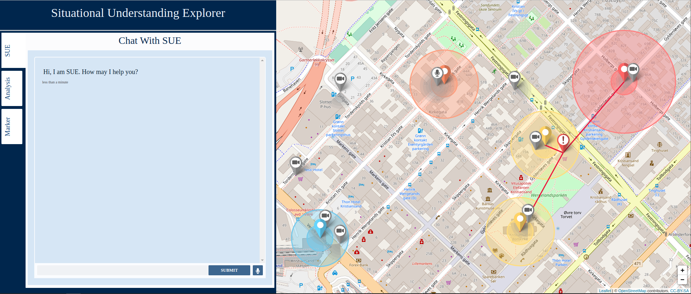

# SUE
Situational Understanding Explorer. An interface designed to showcase new situational awareness/ understandin research on a city-based map integration. This interface can take inputs in the form of JSON documents and display then as markers on the map, with features to allow user interaction and customisation.  
Currently being used to display sensors and events around a city, with sensors being data capturers, such as CCTV cameras and microphones, and events being AI detected anomolous events that are discovered within sensor feeds.  

## Features
### Chatbot
The interface features a chatbot through which users can customise the map, removing objects they don't want to see, to reduce potential clutter and assist in their situational understanding development.  

### Analysis Page
Featuring a bar chart of events sorted by priority, which can be used to focus the map view on events of one priority, and a timeline of events occuring for the last 5 minutes.

### WebSocket
The gif below shows the submission of a JSON object to the WebSocket (found at ws://localhost:8000) using Smart WebSocket Client for Google Chrome.  
*More information on how to form and send a WebSOcket request avaliable in WebSocket.md*

  

### Colour-Blindness Support
Using a command to enter accessibility mode in the Chatbot, the colour scheme used for events on the map changes to a colour blind friendly scheme.  

## Recommendations
It is recommended to run this interface on a:  
- (Ubuntu-based) Linux VM  

Viewing the interface with the browser:  
- Google Chrome

## Installation
### Linux
Clone this git repository and open a termial in the SUE folder, run  
$ bash linux-build.sh  
*This may take a while. If the installation pauses and asks you to confirm storage space requirements, enter y and it will continue.*  

## Running
### Linux
In a terminal in the SUE folder, run  
$ bash linux-run.sh  
*These scripts have set ports (8000, 8080, 8081, and 8082)*  

View the dashboard by opening a web browser and going to **http://localhost:8082/map.html**

## On-Going Development
### WebSocket File Uploads 
File uploads have yet to be implemented through the WebSocket. When implmented a user should be able to upload a video file and create a new Event linked to that file.  

### Online Hosting
Plans to host SUE online, so it can be quickly tested by anyone, are in motion.  

### Input Through the Chatbot
Plans to allow users to enter json into the Chatbot, or a semantic description of 2 or more events being linked, and to see SUE be updated with this information. 

### Highlight Events within a Complex Event
On the hover of an event within a complex event timeline, the event should be highlighted on the map.
